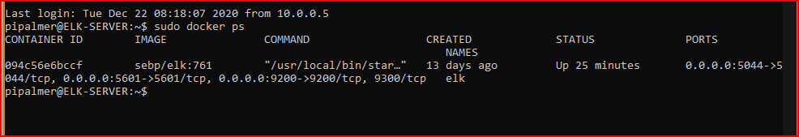

## Automated ELK Stack Deployment

The files in this repository were used to configure the network depicted below.

.png)   

These files have been tested and used to generate a live ELK deployment on Azure. They can be used to either recreate the entire deployment pictured above or install only certain pieces of it, such as Filebeat or metricbeat.

---
---

```yml
---
- name: installing and launching filebeat
  hosts: ELKSERVER
  become: yes
  tasks:

  - name: download filebeat deb
    command: curl -L -O https://artifacts.elastic.co/downloads/beats/filebeat/filebeat-7.6.1-amd64.deb

  - name: install filebeat deb
    command: dpkg -i filebeat-7.6.1-amd64.deb

  - name: drop in filebeat.yml
    copy:
      src: /etc/ansible/files/filebeat-config.yml
      dest: /etc/filebeat/filebeat.yml

  - name: enable and configure system module
    command: filebeat modules enable system

  - name: setup filebeat
    command: filebeat setup

  - name: start filebeat service
    command: service filebeat start
```

---


---
This document contains the following details:
- Description of the Topology
- Access Policies
- ELK Configuration
  - Beats in Use
  - Machines Being Monitored
- How to Use the Ansible Build


### Description of the Topology

The main purpose of this network is to expose a load-balanced and monitored instance of DVWA, the D*mn Vulnerable Web Application.

Load balancing ensures that the application will be highly  **available**, in addition to restricting **unauthorized access** to the network.
- ``Load balancer protects the infrastructure from potential malicious actor(s).  Load balancer will mitigate DoS attacks. (Denial of Service)``    
- ``Main advantages of a JumpBox - forces all traffic through a single node which allows fanning in implementation. (creates a streamlined atmosphere to implement, updates/upgrades from preferable a single machine.)`` 

Integrating an ELK server allows users to easily monitor the vulnerable VMs for changes to the _____Logs and system ____files .
- Filebeat watches for the following: ``Log(s) information regarding file system, including but not limited to which file(s) have changed and when.`` *Filebeat will collect, parse, and visualize Elk logs in a single command.*
- Metricbeat record the following:  metrics and statistics data collections and ships them to the output that is specified, ie. Elasticsearch or Logstash. 

The configuration details of each machine may be found below.
_Note: Use the [Markdown Table Generator](http://www.tablesgenerator.com/markdown_tables) to add/remove values from the table_.

| Name       | Function    | IP Address    | Operating System     |
| ---------- | ----------- | ------------- | -------------------- |
| JumpBox    | Provisioner | 104.42.70.2   | Linux (ubuntu 18.04) |
| Web-1      | Server      | 10.0.0.6      | Linux (ubuntu 18.04) |
| Web-2      | Server      | 10.0.0.7      | Linux (ubuntu 18.04) |
| Web-3      | Server      | 10.0.0.10     | Linux (ubuntu 18.04) |
| ELK-Server | Server      | 168.61.191.41 | Linux (ubuntu 18.04) |
|            |             |               |                      |

### Access Policies

The machines on the internal network are not exposed to the public Internet. 

Only the **JumpBox virtual machine** can accept connections from the Internet. Access to this machine is only allowed from the following IP addresses:
- **47.158.4.55**

Machines within the network can only be accessed by the following commands: **sudo docker container start festive_allen && sudo docker attach festive_allen**.  *Run this command to establish the container.  Once the container (festive_allen) starts you will change from pipalmer@JumpBox-Provisioner to root@0208cb6bf875.*
- _TODO: Which machine did you allow to access your ELK VM? What was its IP address?_  **JumpBox-Provisioner container (festive_allen) 172.17.0.2**

A summary of the access policies in place can be found in the table below.

| Name                | Publicly Accessible   | Allowed IP Addresses |
| ------------------- | --------------------- | -------------------- |
| JumpBox-Provisioner | Yes/No   **---NO---** | 47.158.4.55          |
|                     |                       |                      |
|                     |                       |                      |

### Elk Configuration

Ansible was used to automate configuration of the ELK machine. No configuration was performed manually, which is advantageous because...
- **Main advantage utilizing an automation tool to assist with the  configuration with ansible; creates a streamline process.  Utilizing open source tools and utilizes the flexibility regarding deployment from anywhere in the world *(internet accessibility)*.  Also very efficient without the need to install extra software.     **

The playbook implements the following tasks:
- Install docker.io
- Install pip3 (python3-pip)
- Install Docker python module
- Use more memory (memory increased)
- Download and launch a docker elk container.

The following screenshot displays the result of running `docker ps` after successfully configuring the ELK.

 


### Target Machines & Beats
This ELK server is configured to monitor the following machines:

- 10.0.0.6

- 10.0.0.7

- 10.0.0.10

  

We have installed the following Beats on these machines:
- Successfully installed: Filebeats & Metricbeat

These Beats allow us to collect the following information from each machine:
- **Filebeat will collect, parse, and visualize Elk logs in a single command.  Also collect log information about file system including which files have changed and when they have changed.** *(file generated by Apache, Microsoft Azure tools, the Nginx web server, and MySQL databases.)*  sample collection: server logs, audit logs, wifi.log, error.log.

 Metricbeat collect metrics and statistics. examples: geolocation and timestamps.  

### Using the Playbook
In order to use the playbook, you will need to have an Ansible control node already configured. Assuming you have such a control node provisioned: 

SSH into the control node and follow the steps below:
- Copy the **filebeat_playbook.yml** file to **roles director** _____.
- Update the _**filebeat-config.yml** file to include **ELKSERVER IP ADDRESS******...
- Run the playbook, and navigate to **http://168.61.191.41:5601/app/kibana#/home** to check that the installation worked as expected.

_As a **Bonus**, provide the specific commands the user will need to run to download the playbook, update the files, etc._
- docker start elk
- curl https://gist.githubusercontent.com/slape/5cc350109583af6cbe577bbcc0710c93/raw/eca603b72586fbe148c11f9c87bf96a63cb25760/Filebeat to /etc/ansible/files/filebeat-config.yml
-nano filebeat-config.yml

edit output.elasticsearch host to ["10.1.0.6:9200"]
edit setup.kibana host to ["10.1.0.6:5601"]

- curl https://artifacts.elastic.co/downloads/beats/filebeat/filebeat-7.4.0-amd64.deb to /etc/ansible/files/filebeat-7.4.0-amd64.deb
- dpkg -i filebeat-7.4.0-amd64.deb
- copy filebeat-config.yml from container to Web-VMs
- filebeat modules enable system
- filebeat setup
- service metricbeat start
- ansible-playbook filebeat-playbook.yml
- curl https://artifacts.elastic.co/downloads/beats/metricbeat/metricbeat-7.4.0-amd64.deb to /etc/ansible/files/metricbeat-7.4.0-amd64.deb
- dpkg -i metricbeat-7.4.0-amd64.deb
- update metric-config.yml from container to Web-VMs
- metricbeat modules enable docker
- metricbeat setup
- metricbeat -e

